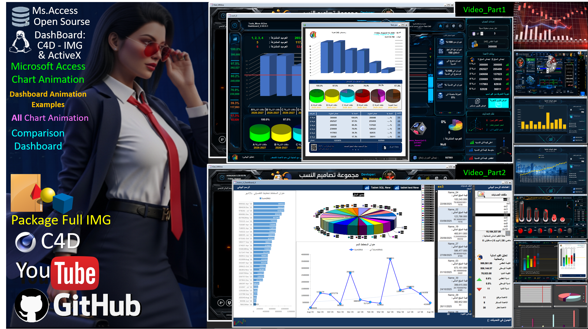

# Microsoft Access Developer Tools

Open-source tools, sample databases, dashboards, chart animations, ActiveX examples, UI/UX assets and reusable VBA components for Microsoft Access developers.

مجموعة مشاريع وأدوات مفتوحة المصدر لمطوري Microsoft Access وVBA، تشمل الرسوم البيانية المتحركة، لوحات المعلومات، ActiveX، تصميم الواجهات، قواعد بيانات تجريبية وأدوات قابلة لإعادة الاستخدام.

---

## 📊 Microsoft Access Chart Animation Dashboard

  

  <b>Microsoft Access • VBA • Chart Animation • ActiveX • Dashboard • UI/UX</b>

### 🎥 Demo & Project Links

- ▶️ **Video Part 1:** [Watch on YouTube](https://youtu.be/dskebqYvo0o)
- ▶️ **Video Part 2:** [Watch on YouTube](https://youtu.be/cvk6KID-FlI)
- 🌐 **Project Website:** [Open Project Library](https://sites.google.com/view/mas-projectss/sample-databases-all-for-type-full)
- 📦 **Full Package:** Available from the project website
- 🧰 **Mini Version:** Lightweight developer version

  
Advanced examples of animated charts and dashboards built directly inside Microsoft Access.

### Features

- Animated Microsoft Access charts
- ActiveX chart animation examples
- Dynamic table switching
- Multiple animation speeds: X20 / X50 / X100
- Percentage-based animation
- Financial data analysis
- Dashboard examples
- Transparent/custom chart backgrounds
- UI/UX interface examples
- Sample databases for developers

### العربية

مشروع مخصص لمطوري Microsoft Access لعرض أمثلة عملية للرسوم البيانية المتحركة ولوحات المعلومات.

يشمل تحريك الرسوم، تغيير مصادر البيانات ديناميكياً، سرعات حركة متعددة، تحليل البيانات المالية، رسوم ActiveX، خلفيات مخصصة، وقواعد بيانات تجريبية مفتوحة المصدر.

---

## 🎬 Video Demonstration

### Part 1
Microsoft Access Chart Animation Dashboard — Open Source Developer Tools

### Part 2
Microsoft Access ActiveX Chart Animation & Dashboard Examples

YouTube demonstration links will be available here.

---

## 📦 Downloads

### Mini Version
Lightweight version containing the core tools and examples.

### Full IMG Package
Complete package containing additional UI/UX assets, images, dashboard resources and examples.

Download links will be available through the project website.

---

## 🧰 Project Library

This repository will gradually include:

- Chart Animation
- ActiveX Charts
- Dashboard Designs
- VBA Tools
- UI/UX Assets
- Image Processing Tools
- 3D / 4D Interface Examples
- Sample Access Databases
- Reusable Developer Components

---

## ⚠️ Important

These projects are intended primarily for developers.

Always test forms, modules, queries, ActiveX components and database objects in a backup or test database before importing them into a production project.

---

## 📜 License

MIT License

Open source — use, study, modify and develop the project according to the included license.

---

**Ms_Hanan — Microsoft Access & VBA Developer**

`Microsoft Access` • `VBA` • `Dashboard` • `Chart Animation` • `ActiveX` • `UI/UX` • `Database Tools`
